<div align="center">

<picture>
  <source media="(prefers-color-scheme: dark)" srcset="plugins/patterson-brand/ds/assets/brand/patterson-logo-white.svg">
  
</picture>

# Patterson Design — Claude Code Marketplace

**Trusted Expertise. Unrivaled Support.** — the Patterson Companies design system,
packaged as nine individually installable [Claude Code plugins](https://code.claude.com/docs/en/plugin-marketplaces).


</div>

---

## Table of contents

- [What this is](#what-this-is)
- [Quick start](#quick-start)
- [Plugin catalog](#plugin-catalog)
- [Anatomy of a plugin](#anatomy-of-a-plugin)
- [Repository layout](#repository-layout)
- [Demos](#demos)
- [Dev environment (Codespaces & dev containers)](#dev-environment-codespaces--dev-containers)
- [Maintenance](#maintenance)
- [Brand & licensing](#brand--licensing)

## What this is

Every part of the Patterson design system — the brand core, each template, each UI kit — is its own plugin. Install only what you need; each ships a **skill** (auto-invoked knowledge), **slash commands** (scaffold workflows), a **subagent** (a specialist Claude delegates to), and a self-contained **`ds/` snapshot** of every file it needs.

<p align="center">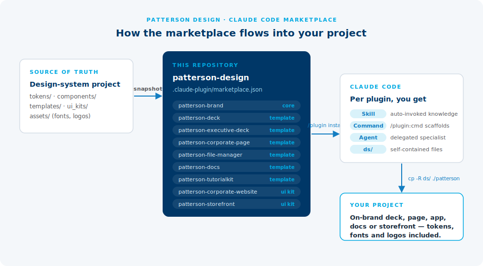</p>

## Quick start

<p align="center">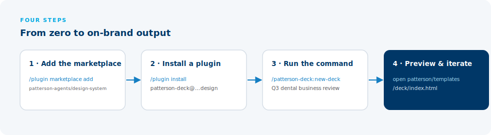</p>

From a git host (push this repo first, keep it **private** — see [Brand & licensing](#brand--licensing)):

```bash
# inside Claude Code
/plugin marketplace add patterson-agents/design-system
/plugin install patterson-brand@patterson-design      # the foundation
/plugin install patterson-deck@patterson-design       # …plus whatever you need
```

From a local checkout:

```bash
cd patterson-design-marketplace
claude
/plugin marketplace add .
/plugin install patterson-deck@patterson-design
```

Then use it three ways:

```text
/patterson-deck:new-deck Q3 dental equipment business review   ← slash command
/patterson-deck:deck-template                                   ← invoke the skill directly
"make me a Patterson deck about our vet supply chain"           ← skill + agent fire automatically
```

## Plugin catalog

| Preview | Plugin | What it is | Primary command |
|---|---|---|---|
| <a href="plugins/patterson-brand/">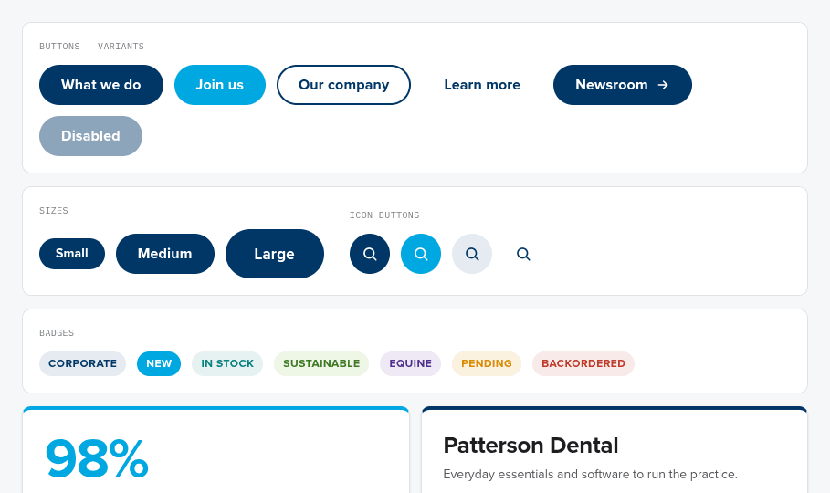</a> | **[`patterson-brand`](plugins/patterson-brand/)**<br>Core | Tokens, fonts, logos, React component library, guideline specimens, framework adapters (Tailwind, UnoCSS, Theme UI, shadcn/ui). | `/patterson-brand:design` |
| <a href="plugins/patterson-deck/"></a> | **[`patterson-deck`](plugins/patterson-deck/)**<br>Template | 16:9 company deck — cover, stats, comparison, quote, photo band, closing. Print-to-PDF ready. | `/patterson-deck:new-deck` |
| <a href="plugins/patterson-executive-deck/">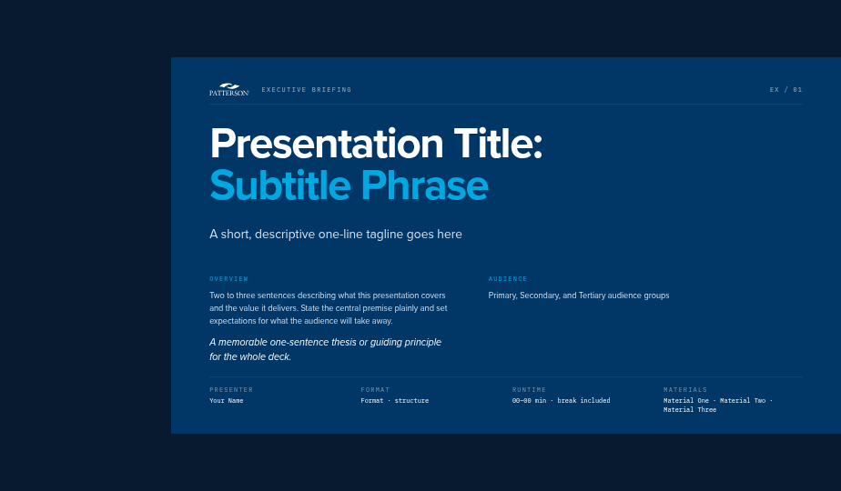</a> | **[`patterson-executive-deck`](plugins/patterson-executive-deck/)**<br>Template | Editorial executive briefing — takeaways, matrices, requirements, outputs. | `/patterson-executive-deck:new-executive-deck` |
| <a href="plugins/patterson-corporate-page/">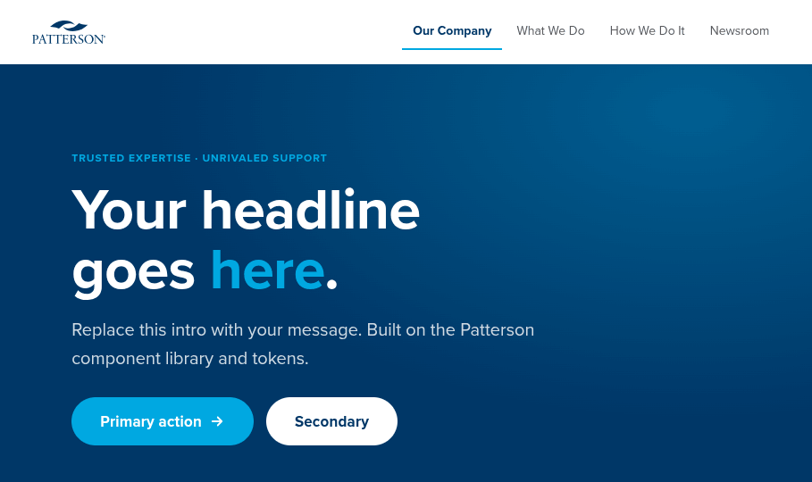</a> | **[`patterson-corporate-page`](plugins/patterson-corporate-page/)**<br>Template | Web page shell — sticky nav, navy hero, content band, footer. React, no build step. | `/patterson-corporate-page:new-page` |
| <a href="plugins/patterson-file-manager/">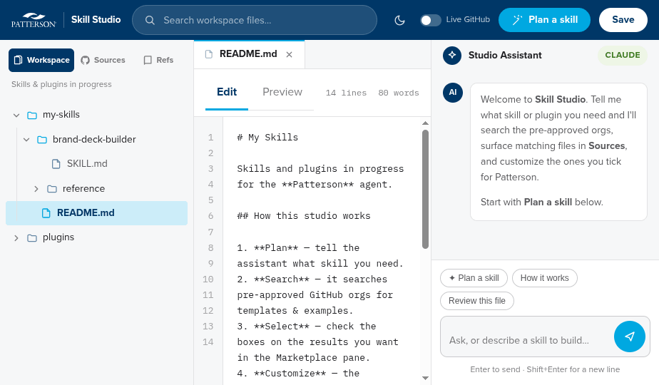</a> | **[`patterson-file-manager`](plugins/patterson-file-manager/)**<br>Template | “Skill Studio” app shell for internal tools — top bar, sidebar tree, content grid. | `/patterson-file-manager:new-app-shell` |
| <a href="plugins/patterson-docs/">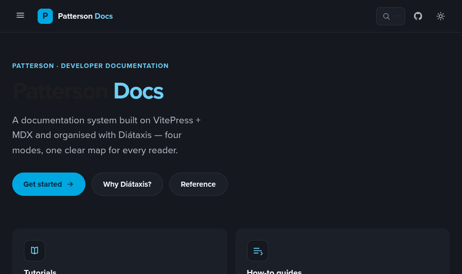</a> | **[`patterson-docs`](plugins/patterson-docs/)**<br>Template | Docs-site UI kit (VitePress + Diátaxis style) plus a standalone docs page template. | `/patterson-docs:new-docs` |
| <a href="plugins/patterson-tutorialkit/">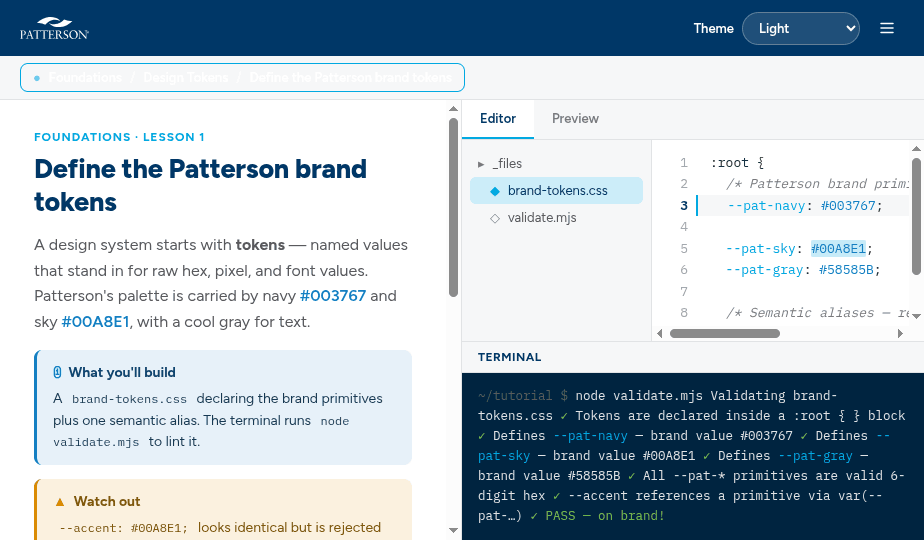</a> | **[`patterson-tutorialkit`](plugins/patterson-tutorialkit/)**<br>Template | Runnable TutorialKit (Astro) starter with the canonical Patterson theme.css. | `/patterson-tutorialkit:brand-tutorialkit` |
| <a href="plugins/patterson-corporate-website/"></a> | **[`patterson-corporate-website`](plugins/patterson-corporate-website/)**<br>UI kit | Corporate-site screens — home hero, stats, capability tabs, newsroom, header, footer. | `/patterson-corporate-website:new-corporate-site` |
| <a href="plugins/patterson-storefront/">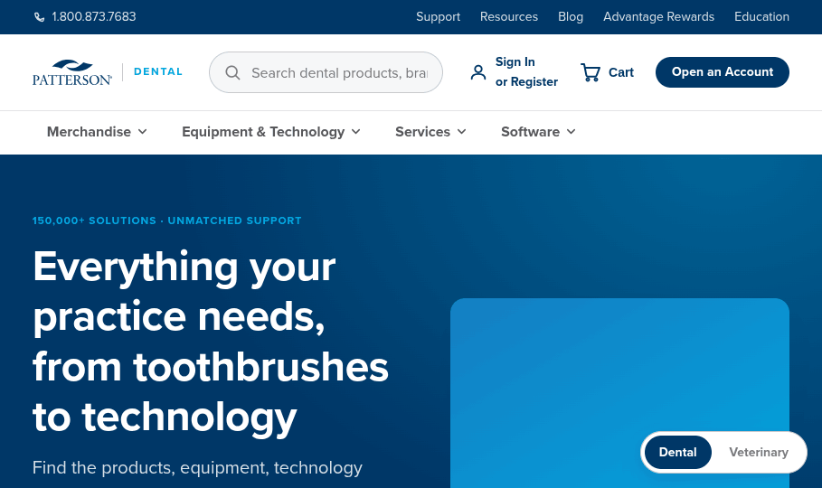</a> | **[`patterson-storefront`](plugins/patterson-storefront/)**<br>UI kit | E-commerce shell with a Dental ↔ Veterinary brand toggle — search, flyout nav, products, rewards. | `/patterson-storefront:new-storefront` |

Each plugin has its own README with a file tree, usage examples, and a terminal demo — click through the table.

## Anatomy of a plugin

<p align="center">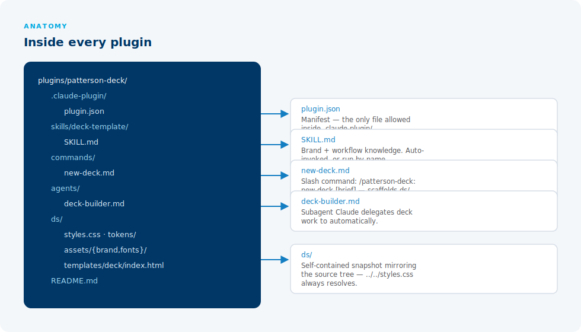</p>

The `ds/` snapshot is the key idea — it mirrors the design-system source tree, so every relative reference inside the files works in this repo, in the plugin cache, and after being copied into a project:

<p align="center">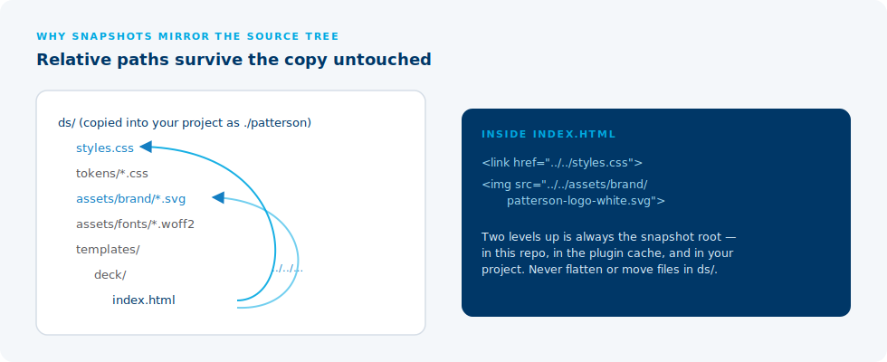</p>

## Repository layout

```text
patterson-design-marketplace/
├── .claude-plugin/
│   └── marketplace.json          # the catalog Claude Code reads
├── plugins/                      # 9 self-contained plugins (see table above)
│   └── <name>/
│       ├── .claude-plugin/plugin.json
│       ├── skills/<skill>/SKILL.md
│       ├── commands/*.md         # slash commands
│       ├── agents/*.md           # subagents
│       ├── ds/                   # design-system snapshot (tokens, fonts, logos, artifact)
│       └── README.md
├── docs/                         # docs site + screenshots + diagrams
├── demos/                        # HTML demo gallery + VHS terminal-demo tapes
├── .devcontainer/                # Node 22 + Claude Code + OpenCode + Copilot CLI + gh
├── .vscode/                      # settings, tasks, launch, extension picks
├── .github/                      # copilot-instructions.md + CI workflows
├── devcontainer-template/        # publishable Dev Container Template (patterson-agents)
├── dotfiles/                     # agent aliases + idempotent install.sh
└── README.md                     # you are here
```

> Publishing this to GitHub or handing it to a developer? Start from
> **[CLAUDE_CODE_HANDOFF.md](CLAUDE_CODE_HANDOFF.md)** — a paste-ready Claude Code prompt that
> walks through publishing, validation, the Codespaces path, and the snapshot-sync maintenance loop.

## Demos

- **[demos/index.html](demos/index.html)** — a browsable gallery of every plugin's live artifact (open locally, or `npx serve` and visit `/demos/`).
- **[demos/vhs/](demos/vhs/)** — one [VHS](https://github.com/charmbracelet/vhs) tape per plugin scripting a real terminal session (install → slash command). Render the GIFs with:

```bash
brew install vhs        # or: go install github.com/charmbracelet/vhs@latest
vhs demos/vhs/patterson-deck.tape     # writes demos/vhs/gif/patterson-deck.gif
for t in demos/vhs/*.tape; do vhs "$t"; done   # render all
```

Each plugin README embeds its GIF once rendered.

<p align="center">
  
</p>

## Dev environment (Codespaces & dev containers)

Open the repo in GitHub Codespaces or VS Code Dev Containers and the whole agent toolchain is preinstalled: **Claude Code** (`claude`), **OpenCode** (`opencode`), **GitHub Copilot CLI** (`copilot`) and **`gh`**.

| Piece | What it does |
|---|---|
| [`.devcontainer/`](.devcontainer/) | Node 22 image + gh & Claude Code features; `setup.sh` installs Copilot CLI + OpenCode during prebuild |
| [`.vscode/`](.vscode/) | `marketplace.json` schema validation, docs live-preview, `claude plugin validate .` as the default test task |
| [`.github/copilot-instructions.md`](.github/copilot-instructions.md) | repo conventions Copilot loads automatically |
| [`.github/workflows/`](.github/workflows/) | GHCR image prebuild + Dev Container Template publishing |
| [`devcontainer-template/`](devcontainer-template/) | spec-compliant template (`patterson-agents`) — `devcontainer templates apply -t ghcr.io/patterson-agents/design-system/patterson-agents:latest` |
| [`dotfiles/`](dotfiles/) | `cc`/`oc`/`cop` aliases, `mpadd` to register this checkout as a marketplace — Codespaces-dotfiles ready |

Two repo-settings clicks after pushing: enable **Codespaces prebuilds** (Settings → Codespaces) and tick **Template repository** (Settings → General) so “Use this template → Open in a codespace” works.

## Maintenance

This marketplace is **generated from the design-system project**. When tokens, assets, or a template change at the source:

1. Re-copy the affected files into every plugin's `ds/` snapshot (they are plain copies — same paths).
2. Bump the plugin `version` in `plugins/<name>/.claude-plugin/plugin.json` **and** in `.claude-plugin/marketplace.json`.
3. Validate:

```bash
claude plugin validate .
```

Rules that keep it working: only `plugin.json` lives inside `.claude-plugin/`; never flatten or move files inside `ds/`; never hand-edit `ds/_ds_bundle.js` (generated).

## Brand & licensing

Patterson logos, Proxima Nova woff2 subsets, and brand imagery are **proprietary**. Distribute this marketplace privately (internal git host or private GitHub repo). No emoji in any brand surface — it's a B2B healthcare distribution brand.
