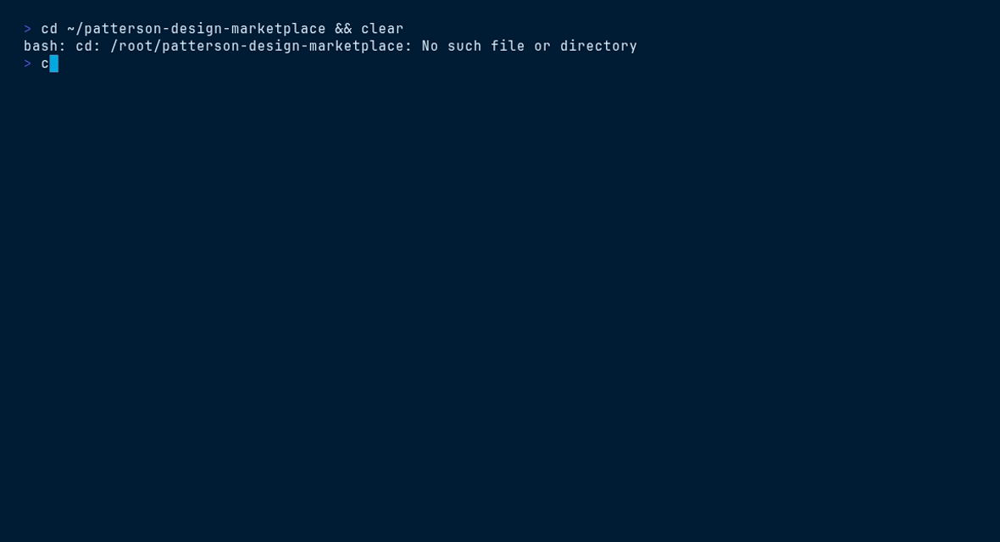

# Patterson Companies — Framework integrations

The Patterson design system ships as **framework-agnostic tokens** plus **first-class
adapters** so the exact same brand — navy `#003767`, sky `#00A8E1`, cool-gray neutrals,
pill buttons, navy-tinted elevation, Proxima Nova — renders identically whether you build
with the design system's own React components, Theme UI, Tailwind CSS v4, UnoCSS, or
shadcn/ui.

Everything in this folder is generated from one source of truth: **`../theme.json`**
(which mirrors `../tokens/*.css`). Change a token there and in the CSS, and every adapter
below stays in step.

| File | For | What it gives you |
|---|---|---|
| `theme-ui.js` | **Theme UI** | A spec-compliant theme object with `buttons`, `text`, `cards`, `badges`, `forms`, `links` variants |
| `tailwind.css` | **Tailwind v4** | CSS-first `@theme` — `bg-navy`, `text-sky`, `rounded-lg`, `shadow-md`, `font-display`, … |
| `tailwind.config.js` | **Tailwind v3 / JS config** | The same scale as a `theme.extend` preset |
| `uno.config.js` | **UnoCSS** | Theme values + brand shortcuts (`btn-primary`, `pat-card`, `stat`, `eyebrow`) |
| `shadcn-theme.css` | **shadcn/ui** | shadcn's semantic CSS-variable contract, mapped to the brand (light + navy dark) |

> The canonical hexes live in `theme.json`. Adapters use the real brand hexes rather than
> re-derived color spaces so nothing drifts off-brand. Spacing everywhere follows the 4px
> base grid — which is already Tailwind/UnoCSS's default spacing unit, so `p-4` = `--space-4`.

---

## Theme UI

Follows the [Theme UI theme spec](https://theme-ui.com/theme-spec) and
[theming](https://theme-ui.com/theming) docs.

```jsx
import { ThemeUIProvider } from 'theme-ui';
import theme from '@patterson/design-system/integrations/theme-ui.js';

export default function App({ children }) {
  return <ThemeUIProvider theme={theme}>{children}</ThemeUIProvider>;
}
```

Then use the `sx` prop and the variants:

```jsx
<h1 sx={{ variant: 'text.display' }}>Trusted Expertise. Unrivaled Support.</h1>
<p sx={{ variant: 'text.eyebrow' }}>Since 1877</p>
<button sx={{ variant: 'buttons.primary', height: 'controlMd', px: 5 }}>Shop Patterson</button>
<div sx={{ variant: 'cards.interactive' }}>…</div>
```

Scales are keyed by name (`px: 5` → `--space-5` = 1.5rem; `fontSize: 'h2'`; `color: 'sky'`).
See the [Theme UI resources](https://theme-ui.com/resources) for MDX, Gatsby and Next.js setups.

---

## Tailwind CSS v4

v4 is CSS-first — the theme *is* CSS:

```css
/* app.css */
@import "tailwindcss";
@import "@patterson/design-system/integrations/tailwind.css";
```

```html
<button class="inline-flex items-center gap-2 h-11 px-6 rounded-pill font-semibold
               bg-navy text-white border-2 border-navy transition-colors
               hover:bg-sky hover:border-sky focus-visible:ring-3 focus-visible:ring-ring">
  Shop Patterson
</button>
<h1 class="font-display text-display font-bold tracking-tight text-heading">Trusted Expertise.</h1>
<span class="text-stat font-display font-bold text-sky">98%</span>
```

Prefer a JS config, or on Tailwind v3? Use `tailwind.config.js` instead:

```js
import patterson from '@patterson/design-system/integrations/tailwind.config.js';
export default { presets: [patterson], content: ['./src/**/*.{html,js,jsx,ts,tsx}'] };
```

To also read raw Patterson custom properties (`var(--pat-navy)`) in a Tailwind project,
additionally link `../styles.css`.

---

## UnoCSS

```js
// uno.config.js
import { defineConfig, presetWind4, presetIcons } from 'unocss';
import { pattersonPreset } from '@patterson/design-system/integrations/uno.config.js';

export default defineConfig({
  presets: [presetWind4(), presetIcons({ scale: 1.1 }), pattersonPreset()],
});
```

The preset ships brand **shortcuts** so common recipes are one class:

```html
<button class="btn btn-primary">Shop Patterson</button>
<button class="btn btn-outline">Learn more</button>
<div class="pat-card-interactive">…</div>
<p class="eyebrow">Since 1877</p>
<span class="stat">86,000,000</span>
<input class="input" placeholder="Search products" />
```

The preset is also the module's default export, so `import pattersonPreset from '…/uno.config.js'`
works too. It carries only theme data + shortcuts (no `unocss` dependency of its own), so you
provide `defineConfig` and the base presets in your own config as shown above.

---

## shadcn/ui

shadcn generates a block of semantic CSS variables. Replace it with Patterson's:

```css
/* globals.css */
@import "tailwindcss";
@import "tw-animate-css";
@import "@patterson/design-system/integrations/shadcn-theme.css";
```

Now every shadcn component (`Button`, `Card`, `Input`, `Dialog`, `Tabs`, `Badge`, charts,
sidebar) renders in Patterson navy & sky with no per-component edits. Light mode is the
paper-white brand ground; `.dark` is the brand's navy emphasis surface.

Patterson buttons are **pills** — set the shadcn Button radius accordingly, e.g. add
`className="rounded-full"` or change the button variant's `rounded-md` to `rounded-full`.

`--radius` is `10px` (the brand card radius); the sidebar variables map to a branded navy rail.

---

## Which should I use?

- **Building inside this design system / a React app that wants ready components** →
  use the compiled components on `window.PattersonCompaniesDesignSystem_1f7cbe` (see the
  root `readme.md`). No adapter needed.
- **A Theme UI app** → `theme-ui.js`.
- **A Tailwind or shadcn/ui app** → `tailwind.css` (+ `shadcn-theme.css` for shadcn).
- **A UnoCSS app** → `uno.config.js`.

All five render the same brand. Pick the one your stack already uses.

## VHS terminal demo


