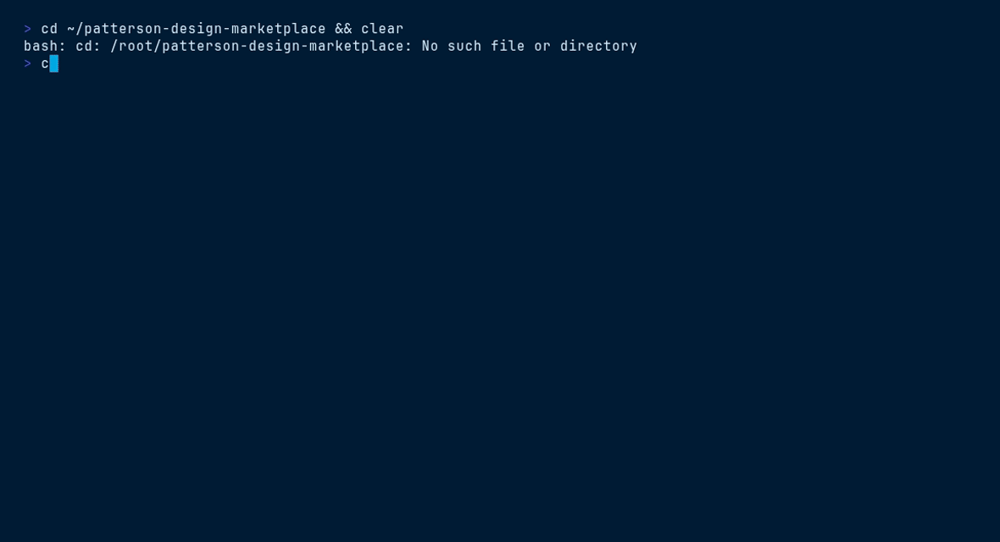

<picture>
  <source media="(prefers-color-scheme: dark)" srcset="ds/assets/brand/patterson-logo-white.svg">
  
</picture>

# Corporate Page — `patterson-corporate-page`

> Web page shell · sticky nav · navy hero · React, no build step


## Contents

- [Install](#install)
- [What you get](#what-you-get)
- [Quick start](#quick-start)
- [File tree](#file-tree)
- [Working with it](#working-with-it)
- [Terminal demo](#terminal-demo)
- [Live demo](#live-demo)
- [Brand quick reference](#brand-quick-reference)

## Install

```bash
/plugin marketplace add patterson-agents/design-system   # once
/plugin install patterson-corporate-page@patterson-design
```

## What you get

| Component | Name | Notes |
|---|---|---|
| Skill | `corporate-page-template` | auto-invoked; also runnable as `/patterson-corporate-page:corporate-page-template` |
| Command | `/patterson-corporate-page:new-page` | e.g. `/patterson-corporate-page:new-page careers landing page with stats band` |
| Agent | `page-builder` | extends the shell with sections from design-system components |

## Quick start

```text
/patterson-corporate-page:new-page careers landing page with stats band
```

The command copies `${CLAUDE_PLUGIN_ROOT}/ds` into your project as `./patterson` (merging with snapshots from other Patterson plugins), starts from `patterson/templates/corporate-page/index.html`, and adapts the content to your brief — structure, class names, tokens and voice stay intact.

## File tree

```text
ds/
├── styles.css · tokens/ · assets/{brand,fonts}/ · _ds_bundle.js
└── templates/corporate-page/
    ├── index.html          # the shell — React 18 UMD + Babel, JSX inline
    └── ds-base.js          # loads tokens + _ds_bundle.js (base path ../..)
```

## Working with it

Add sections inside `<main>` between hero and footer. `pat-container` gives the centered max-width column; keep 64–128px section rhythm via `--space-*`:

```jsx
const { Button, Stat, Card } = window.PattersonCompaniesDesignSystem_1f7cbe;

<section style={{ paddingTop: "var(--space-8)", paddingBottom: "var(--space-8)" }}>
  <div className="pat-container">
    <p className="eyebrow">Since 1877</p>
    <h2>Generations of quality customer service</h2>
    <Stat value="60" label="fulfillment centers" />
    <Button>Join us</Button>
  </div>
</section>
```

## Terminal demo

Scripted with [VHS](https://github.com/charmbracelet/vhs) — render it locally:

```bash
vhs ../../demos/vhs/patterson-corporate-page.tape    # → demos/vhs/gif/patterson-corporate-page.gif
```



## Live demo

Open [`ds/templates/corporate-page/index.html`](ds/templates/corporate-page/index.html) straight from this folder (all relative assets resolve), or browse every plugin in the [demo gallery](../../demos/index.html).

## Brand quick reference

Navy `#003767` · Sky `#00A8E1` · body gray `#58585B` — always via `var(--pat-*)` tokens, never raw hexes. Proxima Nova (Figtree fallback). Pill buttons (navy → sky on hover), 10px cards, navy-tinted shadows, sky focus ring. Voice: confident, plain-spoken, “we/you”, numbers as proof. **No emoji.** Full guide: [`patterson-brand`](../patterson-brand/) → `ds/readme.md`.
