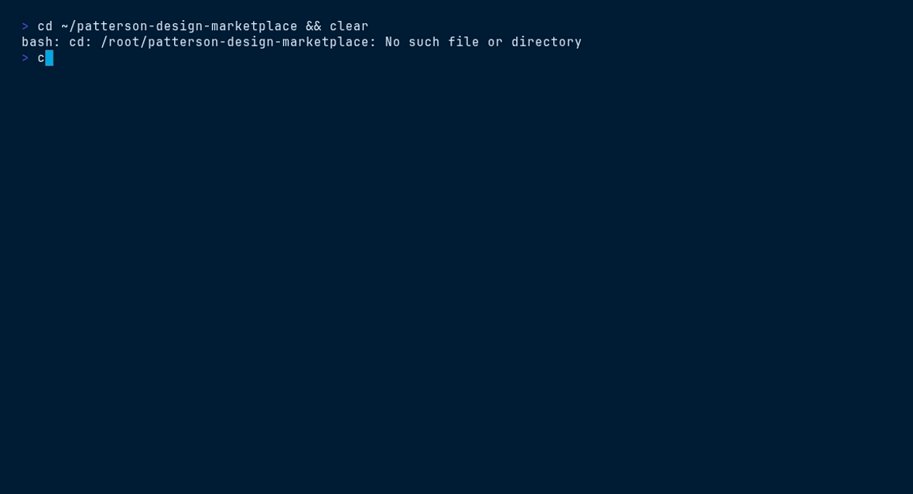

<picture>
  <source media="(prefers-color-scheme: dark)" srcset="ds/assets/brand/patterson-logo-white.svg">
  
</picture>

# Corporate Website Kit — `patterson-corporate-website`

> pattersoncompanies.com screens · hero · stats · newsroom · header/footer


## Contents

- [Install](#install)
- [What you get](#what-you-get)
- [Quick start](#quick-start)
- [File tree](#file-tree)
- [Working with it](#working-with-it)
- [Terminal demo](#terminal-demo)
- [Live demo](#live-demo)
- [Brand quick reference](#brand-quick-reference)

## Install

```bash
/plugin marketplace add patterson-agents/design-system   # once
/plugin install patterson-corporate-website@patterson-design
```

## What you get

| Component | Name | Notes |
|---|---|---|
| Skill | `corporate-website-kit` | auto-invoked; also runnable as `/patterson-corporate-website:corporate-website-kit` |
| Command | `/patterson-corporate-website:new-corporate-site` | e.g. `/patterson-corporate-website:new-corporate-site investor-relations page` |
| Agent | `site-builder` | composes the kit's screens and writes on-voice corporate copy |

## Quick start

```text
/patterson-corporate-website:new-corporate-site investor-relations page
```

The command copies `${CLAUDE_PLUGIN_ROOT}/ds` into your project as `./patterson` (merging with snapshots from other Patterson plugins), starts from `patterson/ui_kits/corporate-website/index.html`, and adapts the content to your brief — structure, class names, tokens and voice stay intact.

## File tree

```text
ds/
├── styles.css · tokens/ · assets/{brand,fonts}/ · _ds_bundle.js
└── ui_kits/corporate-website/
    ├── index.html          # shell — mounts the screens in order
    ├── Header.jsx · Footer.jsx
    ├── HomeScreen.jsx · WhatWeDoScreen.jsx · NewsroomScreen.jsx
    └── icons.jsx           # Lucide-convention inline icons (24×24, 2px stroke)
```

## Working with it

Screens are separate Babel JSX files; navigation is client-side via `onNavigate`. Add a screen by creating a new `*.jsx` and registering it in the app switch in `index.html`:

```jsx
// InvestorsScreen.jsx — new screen, same pattern as NewsroomScreen
function InvestorsScreen({ onNavigate }) {
  return (
    <main>
      {/* hero band on var(--pat-navy), then pat-container sections */}
    </main>
  );
}
window.InvestorsScreen = InvestorsScreen;   // screens share scope via window
```

Reuse `Header`/`Footer` on every screen. Copy tone: corporate, proof-through-numbers — use the `Stat` component for figures.

## Terminal demo

Scripted with [VHS](https://github.com/charmbracelet/vhs) — render it locally:

```bash
vhs ../../demos/vhs/patterson-corporate-website.tape    # → demos/vhs/gif/patterson-corporate-website.gif
```

<!-- Uncomment after rendering the GIF:

-->

## Live demo

Open [`ds/ui_kits/corporate-website/index.html`](ds/ui_kits/corporate-website/index.html) straight from this folder (all relative assets resolve), or browse every plugin in the [demo gallery](../../demos/index.html).

## Brand quick reference

Navy `#003767` · Sky `#00A8E1` · body gray `#58585B` — always via `var(--pat-*)` tokens, never raw hexes. Proxima Nova (Figtree fallback). Pill buttons (navy → sky on hover), 10px cards, navy-tinted shadows, sky focus ring. Voice: confident, plain-spoken, “we/you”, numbers as proof. **No emoji.** Full guide: [`patterson-brand`](../patterson-brand/) → `ds/readme.md`.
