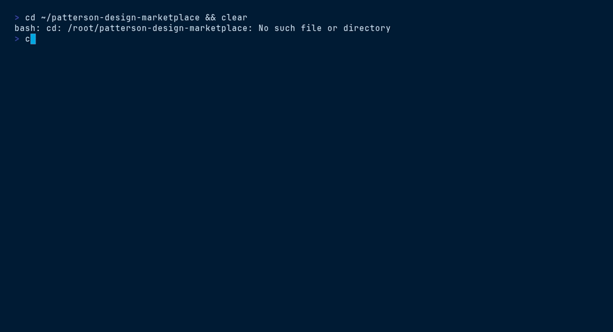

<picture>
  <source media="(prefers-color-scheme: dark)" srcset="ds/assets/brand/patterson-logo-white.svg">
  
</picture>

# Presentation Deck — `patterson-deck`

> 16:9 company deck · 9 slide archetypes · print-to-PDF


## Contents

- [Install](#install)
- [What you get](#what-you-get)
- [Quick start](#quick-start)
- [File tree](#file-tree)
- [Working with it](#working-with-it)
- [Terminal demo](#terminal-demo)
- [Live demo](#live-demo)
- [Brand quick reference](#brand-quick-reference)

## Install

```bash
/plugin marketplace add patterson-agents/design-system   # once
/plugin install patterson-deck@patterson-design
```

## What you get

| Component | Name | Notes |
|---|---|---|
| Skill | `deck-template` | auto-invoked; also runnable as `/patterson-deck:deck-template` |
| Command | `/patterson-deck:new-deck` | e.g. `/patterson-deck:new-deck Q3 dental equipment business review, 8 slides` |
| Agent | `deck-builder` | picks slide archetypes, writes on-voice copy, keeps everything on tokens |

## Quick start

```text
/patterson-deck:new-deck Q3 dental equipment business review, 8 slides
```

The command copies `${CLAUDE_PLUGIN_ROOT}/ds` into your project as `./patterson` (merging with snapshots from other Patterson plugins), starts from `patterson/templates/deck/index.html`, and adapts the content to your brief — structure, class names, tokens and voice stay intact.

## File tree

```text
ds/
├── styles.css · tokens/ · assets/{brand,fonts}/
└── templates/deck/
    ├── index.html          # 9 archetype slides as <section class="slide">
    ├── deck-stage.js       # scaling, keyboard nav, print-to-PDF (1 page/slide)
    └── ds-base.js          # loads the tokens (base path ../..)
```

## Working with it

Slides are plain 1920×1080 HTML — duplicate an archetype `<section>`, delete what the brief doesn't need. Archetypes: navy wave cover · light lead-in · stats grid · comparison columns · section divider · quote · capabilities table · full-bleed photo band · navy closing.

```html
<!-- a light slide with the standard footer — copied from the template -->
<section data-label="Who We Are" class="slide light">
  <div class="pad">
    <h2 class="title">Who we are</h2>
    <p class="lead">An international distributor for the oral and animal health markets.</p>
  </div>
  
  <span class="pageno">03</span>
</section>
```

Rules: keep `data-label` on every section; white logo on navy slides, navy logo on light; big sky numbers for stats; min 24px text; sentence-case headings; no emoji.

## Terminal demo

Scripted with [VHS](https://github.com/charmbracelet/vhs) — render it locally:

```bash
vhs ../../demos/vhs/patterson-deck.tape    # → demos/vhs/gif/patterson-deck.gif
```



## Live demo

Open [`ds/templates/deck/index.html`](ds/templates/deck/index.html) straight from this folder (all relative assets resolve), or browse every plugin in the [demo gallery](../../demos/index.html).

## Brand quick reference

Navy `#003767` · Sky `#00A8E1` · body gray `#58585B` — always via `var(--pat-*)` tokens, never raw hexes. Proxima Nova (Figtree fallback). Pill buttons (navy → sky on hover), 10px cards, navy-tinted shadows, sky focus ring. Voice: confident, plain-spoken, “we/you”, numbers as proof. **No emoji.** Full guide: [`patterson-brand`](../patterson-brand/) → `ds/readme.md`.
