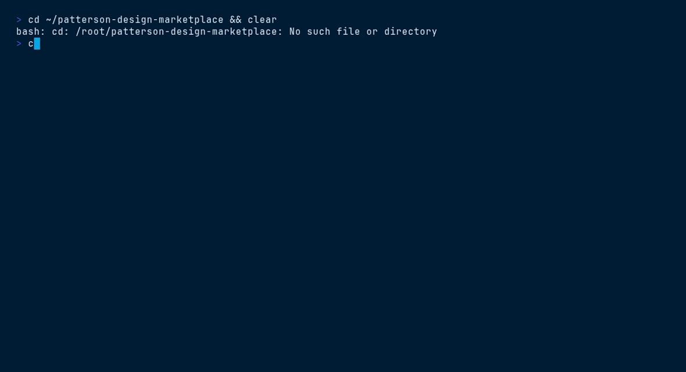

<picture>
  <source media="(prefers-color-scheme: dark)" srcset="ds/assets/brand/patterson-logo-white.svg">
  
</picture>

# Patterson Docs — `patterson-docs`

> Docs-site UI kit (VitePress + Diátaxis style) + standalone page template


## Contents

- [Install](#install)
- [What you get](#what-you-get)
- [Quick start](#quick-start)
- [File tree](#file-tree)
- [Working with it](#working-with-it)
- [Terminal demo](#terminal-demo)
- [Live demo](#live-demo)
- [Brand quick reference](#brand-quick-reference)

## Install

```bash
/plugin marketplace add patterson-agents/design-system   # once
/plugin install patterson-docs@patterson-design
```

## What you get

| Component | Name | Notes |
|---|---|---|
| Skill | `docs-site` | auto-invoked; also runnable as `/patterson-docs:docs-site` |
| Command | `/patterson-docs:new-docs` | e.g. `/patterson-docs:new-docs developer docs for the ordering API` |
| Agent | `docs-designer` | applies Diátaxis structure in the Patterson docs UI kit |

## Quick start

```text
/patterson-docs:new-docs developer docs for the ordering API
```

The command copies `${CLAUDE_PLUGIN_ROOT}/ds` into your project as `./patterson` (merging with snapshots from other Patterson plugins), starts from `patterson/ui_kits/patterson-docs/index.html`, and adapts the content to your brief — structure, class names, tokens and voice stay intact.

## File tree

```text
ds/
├── styles.css · tokens/ · assets/{brand,fonts}/ · _ds_bundle.js
├── ui_kits/patterson-docs/
│   ├── index.html          # docs-site shell (React 18 UMD + Babel)
│   ├── app.jsx             # layout: sidebar · content · aside
│   ├── data.jsx            # nav tree + page registry — edit this first
│   └── pages1.jsx · pages2.jsx · collections.jsx
└── templates/patterson-docs/
    ├── PattersonDocs.dc.html   # standalone docs page — opens directly in a browser
    ├── ds-base.js          # token loader (base path ../..)
    └── support.js
```

## Working with it

Content follows **[Diátaxis](https://diataxis.fr)**: tutorials · how-to guides · reference · explanation. The nav tree and page registry live in `data.jsx` — add pages there and they appear in the sidebar:

```jsx
// data.jsx — illustrative entry
{ section: "How-to guides", items: [
  { id: "place-order", title: "Place an order via the API", kind: "how-to" },
]}
```

For a single doc page rather than a site, edit `templates/patterson-docs/PattersonDocs.dc.html` content in place.

## Terminal demo

Scripted with [VHS](https://github.com/charmbracelet/vhs) — render it locally:

```bash
vhs ../../demos/vhs/patterson-docs.tape    # → demos/vhs/gif/patterson-docs.gif
```



## Live demo

Open [`ds/ui_kits/patterson-docs/index.html`](ds/ui_kits/patterson-docs/index.html) straight from this folder (all relative assets resolve), or browse every plugin in the [demo gallery](../../demos/index.html).

## Brand quick reference

Navy `#003767` · Sky `#00A8E1` · body gray `#58585B` — always via `var(--pat-*)` tokens, never raw hexes. Proxima Nova (Figtree fallback). Pill buttons (navy → sky on hover), 10px cards, navy-tinted shadows, sky focus ring. Voice: confident, plain-spoken, “we/you”, numbers as proof. **No emoji.** Full guide: [`patterson-brand`](../patterson-brand/) → `ds/readme.md`.
