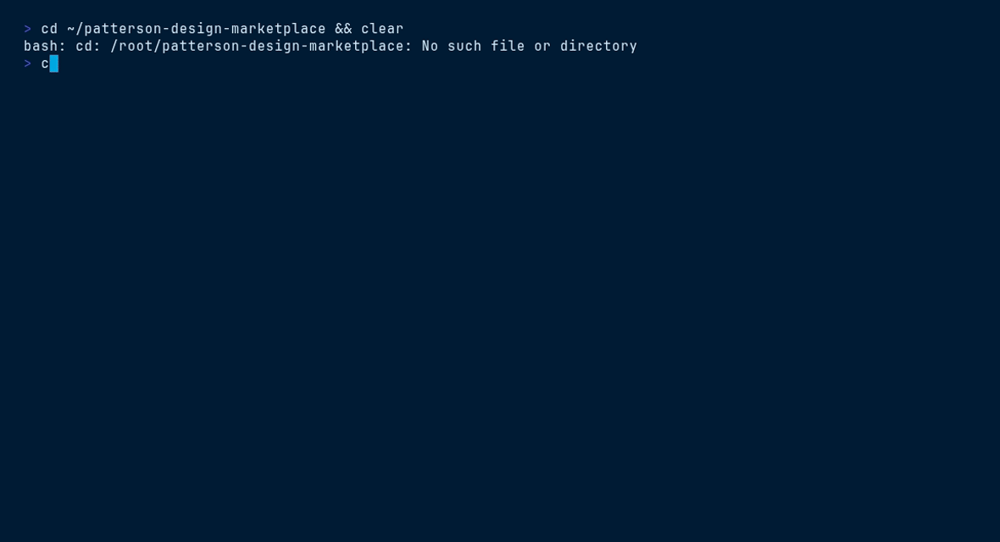

<picture>
  <source media="(prefers-color-scheme: dark)" srcset="ds/assets/brand/patterson-logo-white.svg">
  
</picture>

# Executive Deck — `patterson-executive-deck`

> Editorial executive briefing · takeaways · matrices · requirements


## Contents

- [Install](#install)
- [What you get](#what-you-get)
- [Quick start](#quick-start)
- [File tree](#file-tree)
- [Working with it](#working-with-it)
- [Terminal demo](#terminal-demo)
- [Live demo](#live-demo)
- [Brand quick reference](#brand-quick-reference)

## Install

```bash
/plugin marketplace add patterson-agents/design-system   # once
/plugin install patterson-executive-deck@patterson-design
```

## What you get

| Component | Name | Notes |
|---|---|---|
| Skill | `executive-deck-template` | auto-invoked; also runnable as `/patterson-executive-deck:executive-deck-template` |
| Command | `/patterson-executive-deck:new-executive-deck` | e.g. `/patterson-executive-deck:new-executive-deck FY26 distribution strategy readout for the ELT` |
| Agent | `executive-deck-builder` | distills content into takeaways, matrices and requirement tables |

## Quick start

```text
/patterson-executive-deck:new-executive-deck FY26 distribution strategy readout for the ELT
```

The command copies `${CLAUDE_PLUGIN_ROOT}/ds` into your project as `./patterson` (merging with snapshots from other Patterson plugins), starts from `patterson/templates/executive-deck/index.html`, and adapts the content to your brief — structure, class names, tokens and voice stay intact.

## File tree

```text
ds/
├── styles.css · tokens/ · assets/{brand,fonts}/
└── templates/executive-deck/
    ├── index.html          # cover · takeaways · matrix · requirements · outputs · benefits
    ├── deck-stage.js       # scaling, keyboard nav, print-to-PDF
    └── ds-base.js          # token loader (base path ../..)
```

## Working with it

Denser and more formal than the standard deck. Every slide carries a running footer with a per-slide metadata row — keep and update it:

```html
<div class="foot">
  <div class="row"><span><span class="col-label">Arc</span>diagnose → decide → fund → execute</span></div>
  
</div>
```

`data-tweak` attributes mark speaker/date fields meant to be personalized. Editorial register: terse, declarative, evidence-first — one question answered per slide.

## Terminal demo

Scripted with [VHS](https://github.com/charmbracelet/vhs) — render it locally:

```bash
vhs ../../demos/vhs/patterson-executive-deck.tape    # → demos/vhs/gif/patterson-executive-deck.gif
```

<!-- Uncomment after rendering the GIF:

-->

## Live demo

Open [`ds/templates/executive-deck/index.html`](ds/templates/executive-deck/index.html) straight from this folder (all relative assets resolve), or browse every plugin in the [demo gallery](../../demos/index.html).

## Brand quick reference

Navy `#003767` · Sky `#00A8E1` · body gray `#58585B` — always via `var(--pat-*)` tokens, never raw hexes. Proxima Nova (Figtree fallback). Pill buttons (navy → sky on hover), 10px cards, navy-tinted shadows, sky focus ring. Voice: confident, plain-spoken, “we/you”, numbers as proof. **No emoji.** Full guide: [`patterson-brand`](../patterson-brand/) → `ds/readme.md`.
