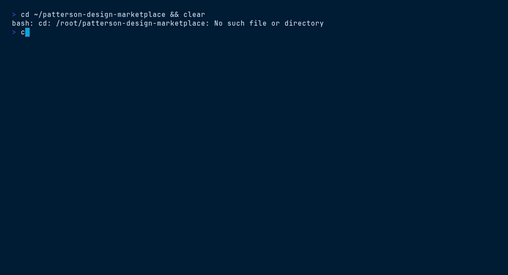

<picture>
  <source media="(prefers-color-scheme: dark)" srcset="ds/assets/brand/patterson-logo-white.svg">
  
</picture>

# Skill Studio (File Manager) — `patterson-file-manager`

> App shell for internal tools · top bar · sidebar tree · content grid


## Contents

- [Install](#install)
- [What you get](#what-you-get)
- [Quick start](#quick-start)
- [File tree](#file-tree)
- [Working with it](#working-with-it)
- [Terminal demo](#terminal-demo)
- [Live demo](#live-demo)
- [Brand quick reference](#brand-quick-reference)

## Install

```bash
/plugin marketplace add patterson-agents/design-system   # once
/plugin install patterson-file-manager@patterson-design
```

## What you get

| Component | Name | Notes |
|---|---|---|
| Skill | `file-manager-template` | auto-invoked; also runnable as `/patterson-file-manager:file-manager-template` |
| Command | `/patterson-file-manager:new-app-shell` | e.g. `/patterson-file-manager:new-app-shell asset-approval workspace for the brand team` |
| Agent | `app-prototyper` | adapts the shell (top bar, sidebar, grid) to new tool concepts |

## Quick start

```text
/patterson-file-manager:new-app-shell asset-approval workspace for the brand team
```

The command copies `${CLAUDE_PLUGIN_ROOT}/ds` into your project as `./patterson` (merging with snapshots from other Patterson plugins), starts from `patterson/templates/file-manager/index.html`, and adapts the content to your brief — structure, class names, tokens and voice stay intact.

## File tree

```text
ds/
├── styles.css · tokens/ · assets/{brand,fonts}/ · _ds_bundle.js
└── templates/file-manager/
    ├── index.html          # the app shell (React 18 UMD + Babel)
    ├── app-data.js         # sample data model — replace this first
    ├── studio.js           # interaction logic
    └── ds-base.js          # loads tokens + bundle
```

## Working with it

The shell renders from `app-data.js` — swap the data model for the new tool before touching layout:

```js
// app-data.js — shape is illustrative; keep the exported names
window.APP_DATA = {
  workspaces: [{ id: "brand", label: "Brand assets", items: [/* … */] }],
};
```

Keep the navy top bar with the white logo, ≥44px hit targets, and sky focus rings on every interactive element.

## Terminal demo

Scripted with [VHS](https://github.com/charmbracelet/vhs) — render it locally:

```bash
vhs ../../demos/vhs/patterson-file-manager.tape    # → demos/vhs/gif/patterson-file-manager.gif
```

<!-- Uncomment after rendering the GIF:

-->

## Live demo

Open [`ds/templates/file-manager/index.html`](ds/templates/file-manager/index.html) straight from this folder (all relative assets resolve), or browse every plugin in the [demo gallery](../../demos/index.html).

## Brand quick reference

Navy `#003767` · Sky `#00A8E1` · body gray `#58585B` — always via `var(--pat-*)` tokens, never raw hexes. Proxima Nova (Figtree fallback). Pill buttons (navy → sky on hover), 10px cards, navy-tinted shadows, sky focus ring. Voice: confident, plain-spoken, “we/you”, numbers as proof. **No emoji.** Full guide: [`patterson-brand`](../patterson-brand/) → `ds/readme.md`.
