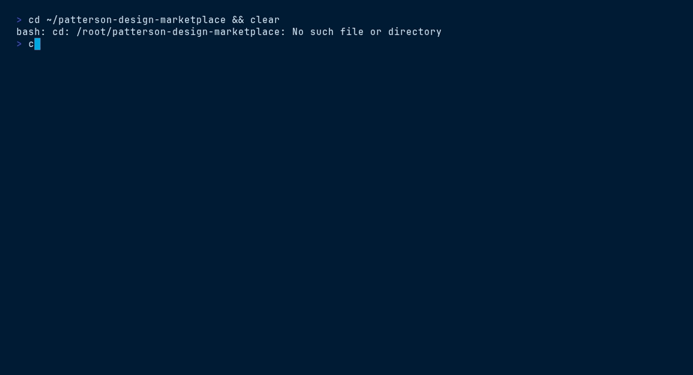

<picture>
  <source media="(prefers-color-scheme: dark)" srcset="ds/assets/brand/patterson-logo-white.svg">
  
</picture>

# Storefront Kit — `patterson-storefront`

> E-commerce shell · Dental ↔ Veterinary toggle · pattern library v5.7.2


## Contents

- [Install](#install)
- [What you get](#what-you-get)
- [Quick start](#quick-start)
- [File tree](#file-tree)
- [Working with it](#working-with-it)
- [Terminal demo](#terminal-demo)
- [Live demo](#live-demo)
- [Brand quick reference](#brand-quick-reference)

## Install

```bash
/plugin marketplace add patterson-agents/design-system   # once
/plugin install patterson-storefront@patterson-design
```

## What you get

| Component | Name | Notes |
|---|---|---|
| Skill | `storefront-kit` | auto-invoked; also runnable as `/patterson-storefront:storefront-kit` |
| Command | `/patterson-storefront:new-storefront` | e.g. `/patterson-storefront:new-storefront vet — product detail page` |
| Agent | `storefront-builder` | composes storefront screens and respects the brand toggle |

## Quick start

```text
/patterson-storefront:new-storefront vet — product detail page
```

The command copies `${CLAUDE_PLUGIN_ROOT}/ds` into your project as `./patterson` (merging with snapshots from other Patterson plugins), starts from `patterson/ui_kits/storefront/index.html`, and adapts the content to your brief — structure, class names, tokens and voice stay intact.

## File tree

```text
ds/
├── styles.css · tokens/ · assets/{brand,fonts}/ · _ds_bundle.js
└── ui_kits/storefront/
    ├── index.html          # shell + brand switch
    ├── brands.js           # Dental / Veterinary config — extend, don't hardcode
    ├── StoreHeader.jsx · StoreHome.jsx · StoreFooter.jsx
    └── icons.jsx
```

## Working with it

`brands.js` drives the Dental ↔ Veterinary toggle (names, nav categories, accent usage). Extend it rather than hard-coding brand strings:

```js
// brands.js — illustrative entry
const BRANDS = {
  dental: { label: "Patterson Dental", nav: ["Supplies", "Equipment", /* … */] },
  vet:    { label: "Patterson Veterinary", nav: ["Pharmaceuticals", /* … */] },
};
```

Keep the chrome order: utility bar → logo+search row → category nav with flyouts → page content → footer. Product cards use the standard Card recipe (10px radius, hairline border, hover lift).

## Terminal demo

Scripted with [VHS](https://github.com/charmbracelet/vhs) — render it locally:

```bash
vhs ../../demos/vhs/patterson-storefront.tape    # → demos/vhs/gif/patterson-storefront.gif
```



## Live demo

Open [`ds/ui_kits/storefront/index.html`](ds/ui_kits/storefront/index.html) straight from this folder (all relative assets resolve), or browse every plugin in the [demo gallery](../../demos/index.html).

## Brand quick reference

Navy `#003767` · Sky `#00A8E1` · body gray `#58585B` — always via `var(--pat-*)` tokens, never raw hexes. Proxima Nova (Figtree fallback). Pill buttons (navy → sky on hover), 10px cards, navy-tinted shadows, sky focus ring. Voice: confident, plain-spoken, “we/you”, numbers as proof. **No emoji.** Full guide: [`patterson-brand`](../patterson-brand/) → `ds/readme.md`.
