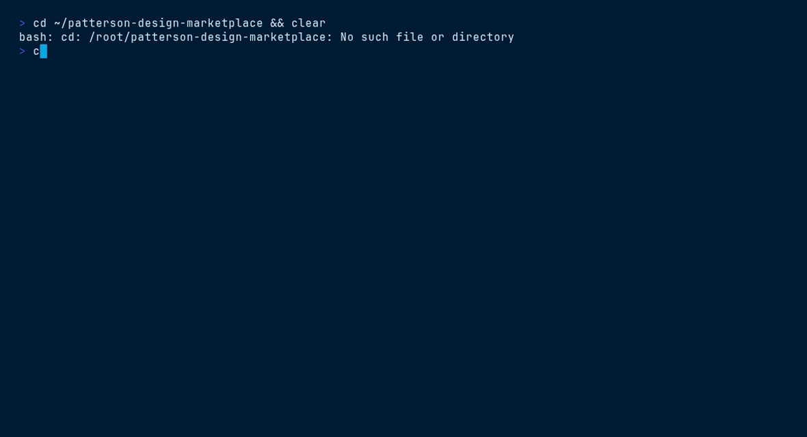

<picture>
  <source media="(prefers-color-scheme: dark)" srcset="ds/assets/brand/patterson-logo-white.svg">
  
</picture>

# TutorialKit Theme — `patterson-tutorialkit`

> Runnable Astro starter · canonical theme.css · interactive tutorials


## Contents

- [Install](#install)
- [What you get](#what-you-get)
- [Quick start](#quick-start)
- [File tree](#file-tree)
- [Working with it](#working-with-it)
- [Terminal demo](#terminal-demo)
- [Live demo](#live-demo)
- [Brand quick reference](#brand-quick-reference)

## Install

```bash
/plugin marketplace add patterson-agents/design-system   # once
/plugin install patterson-tutorialkit@patterson-design
```

## What you get

| Component | Name | Notes |
|---|---|---|
| Skill | `tutorialkit-theme` | auto-invoked; also runnable as `/patterson-tutorialkit:tutorialkit-theme` |
| Command | `/patterson-tutorialkit:brand-tutorialkit` | e.g. `/patterson-tutorialkit:brand-tutorialkit new` |
| Agent | `tutorial-themer` | creates or themes TutorialKit projects with theme.css + logos |

## Quick start

```text
/patterson-tutorialkit:brand-tutorialkit new
```

The command copies `${CLAUDE_PLUGIN_ROOT}/ds` into your project as `./patterson` (merging with snapshots from other Patterson plugins), starts from `patterson/templates/tutorialkit/README.md`, and adapts the content to your brief — structure, class names, tokens and voice stay intact.

## File tree

```text
ds/
├── assets/brand/           # logo lockups
├── templates/tutorialkit/   # runnable starter (Astro + UnoCSS)
│   ├── theme.css           # THE brandable artifact — every color is a --tk-* var
│   ├── astro.config.mjs · uno.config.ts · package.json
│   ├── public/logo.svg · public/logo-dark.svg
│   └── src/                # 5-part / 18-lesson agent-tooling curriculum (AGENTS.md, CLAUDE.md, design.md, skills, MCP, plugins, marketplaces + one lesson per Patterson plugin)
└── ui_kits/tutorialkit/
    └── index.html          # static preview rendering entirely from --tk-* vars
```

## Working with it

**Theme an existing TutorialKit project** — copy two things, nothing else:

```bash
cp patterson/templates/tutorialkit/theme.css      your-tutorial/
cp patterson/templates/tutorialkit/public/logo*.svg your-tutorial/public/
```

**Start fresh** from the bundled starter:

```bash
cp -R patterson/templates/tutorialkit my-tutorial && cd my-tutorial
bun install && bun run dev     # or npm install && npm run dev
```

Every color is a `--tk-*` variable TutorialKit reads natively — change a token in `theme.css` and both the real app and the preview update. Never copy values out of it.

## Terminal demo

Scripted with [VHS](https://github.com/charmbracelet/vhs) — render it locally:

```bash
vhs ../../demos/vhs/patterson-tutorialkit.tape    # → demos/vhs/gif/patterson-tutorialkit.gif
```

<!-- Uncomment after rendering the GIF:

-->

## Live demo

Open [`ds/ui_kits/tutorialkit/index.html`](ds/ui_kits/tutorialkit/index.html) straight from this folder (all relative assets resolve), or browse every plugin in the [demo gallery](../../demos/index.html).

## Brand quick reference

Navy `#003767` · Sky `#00A8E1` · body gray `#58585B` — always via `var(--pat-*)` tokens, never raw hexes. Proxima Nova (Figtree fallback). Pill buttons (navy → sky on hover), 10px cards, navy-tinted shadows, sky focus ring. Voice: confident, plain-spoken, “we/you”, numbers as proof. **No emoji.** Full guide: [`patterson-brand`](../patterson-brand/) → `ds/readme.md`.
